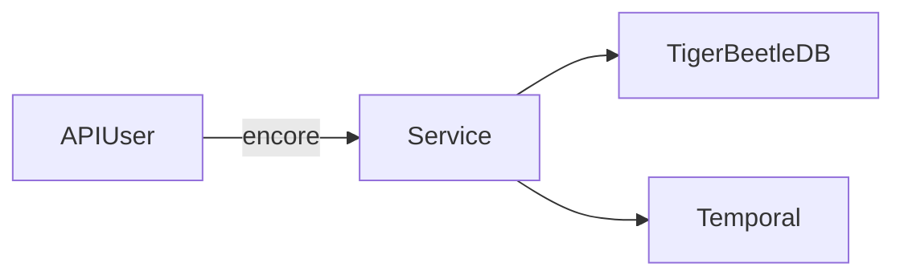
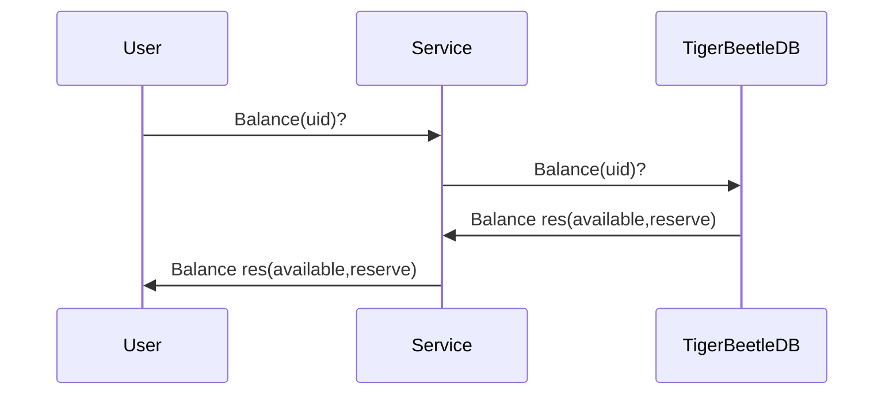
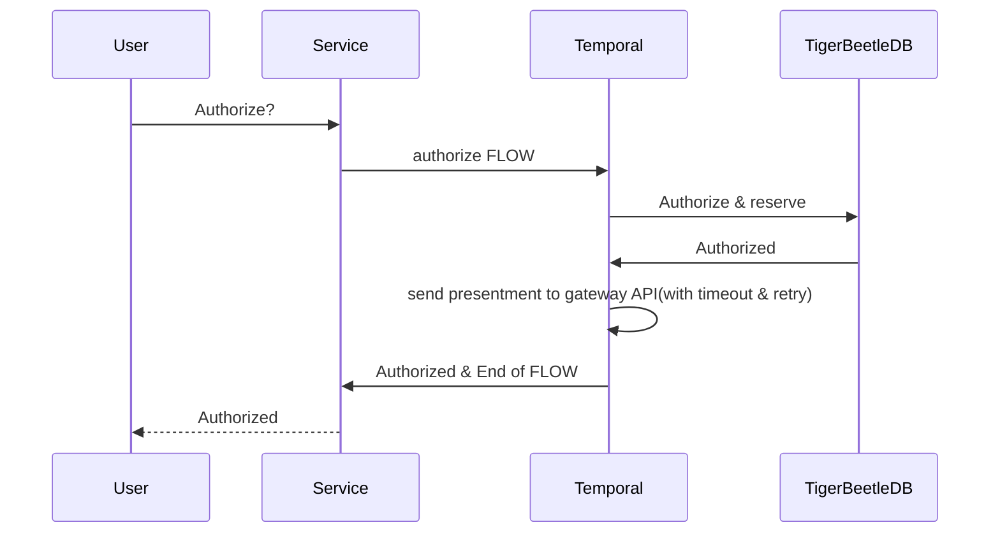
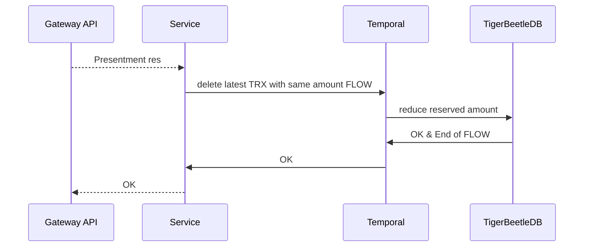
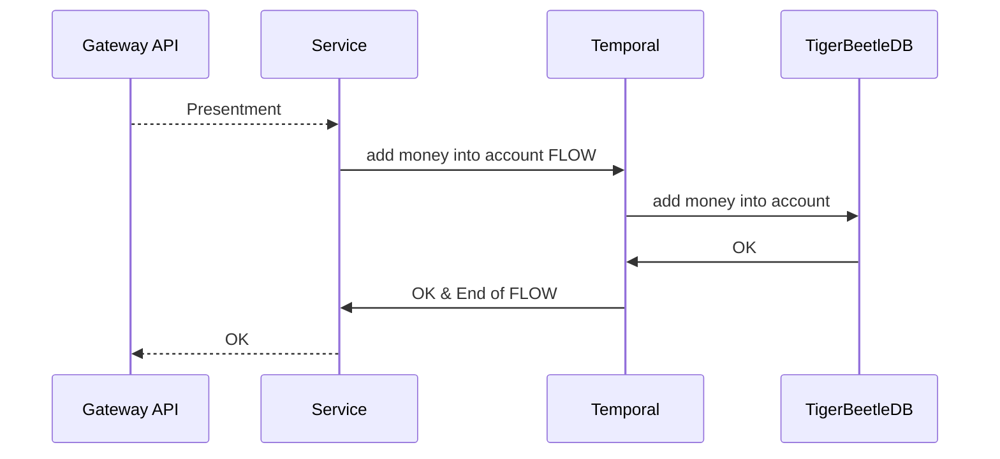

## Architecture

```mermaid
graph LR;
APIUser--encore-->Service
Service-->TigerBeetleDB
Service-->Temporal
```

## Activity Diagram
### balance 

```mermaid
sequenceDiagram
    User->>Service: Balance(uid)?
    Service->>TigerBeetleDB: Balance(uid)?
    TigerBeetleDB->>Service: Balance res(available,reserve)
    Service->>User: Balance res(available,reserve)
```

### authorize

```mermaid
sequenceDiagram
    User->>Service: Authorize?
    Service->>Temporal: authorize FLOW
    Temporal->>TigerBeetleDB: Authorize & reserve
    TigerBeetleDB->>Temporal: Authorized
    Temporal->>Temporal: send presentment to gateway API(with timeout & retry)
    Temporal->>Service: Authorized & End of FLOW
    Service-->>User: Authorized
```
### "sending presentment" response

```mermaid
sequenceDiagram
    Gateway API-->>Service: Presentment res
    Service->>Temporal: delete latest TRX with same amount FLOW
    Temporal->>TigerBeetleDB: reduce reserved amount
    TigerBeetleDB->>Temporal: OK & End of FLOW
    Temporal->>Service: OK
    Service-->>Gateway API: OK
```

### "receive presentment"

```mermaid
sequenceDiagram
    Gateway API-->>Service: Presentment
    Service->>Temporal: add money into account FLOW
    Temporal->>TigerBeetleDB: add money into account
    TigerBeetleDB->>Temporal: OK
    Temporal->>Service:OK & End of FLOW
    Service-->>Gateway API: OK
```
